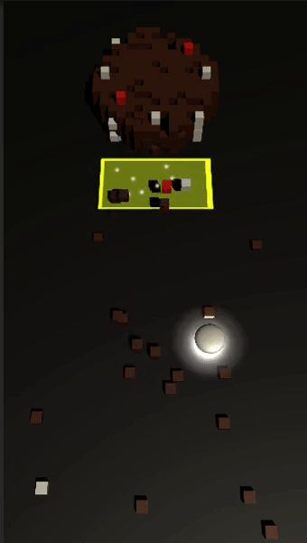

# HC-Prototype3
 HC prototype Collect and build
 
# Context
This project was an exercice of 4 hours to make a prototype of a hyper casual game.
The idea was simple : move a controller to collect objects and build something.

# Demo

  

Here was the vision I had for this project.

# The player
The player controls an avatar and moves it around the level to collect blocks. He is able to collect up to 35 blocks and can put them in the deposit zone whenever he wants.

# The level
The bocks on the level spawn at a random location at a defined rate (depending on the size of a structure). Once the player collected all the blocks and put them in the deposit zone, the player wins the game.

# The reward
The current reward here is to discover what the player has built, what he actually collected blocks for. And the satisfaction of collecting blocks fast.

# Possible impovements
This project is a first shot of the prototype. There are not even a gameplay loop for now. The purpose of this project was to make a fast prototype and evaluate the potential of the game.
After some researches, there is a lot that can be done on this game to improve the attractivness/sexiness and the visibility of the game.
The idea of making the player discover a structure at the end of the run can be exploited. As the player collects blocks and build the structure, he can get hints on what he is building throughout the run.
The levels can also be really creative by having different visual themes and by varying the structures to build.
